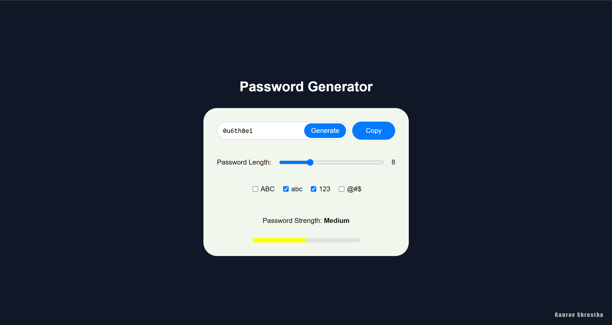

# Password Generator

A simple and customizable password generator built with **Vanilla JavaScript** and **Vite**. This application allows users to generate secure passwords based on selected criteria such as length, uppercase letters, lowercase letters, numbers, and symbols.

---

## Features

- **Customizable Password Length**: Choose a password length between 4 and 20 characters.
- **Character Options**: Include or exclude uppercase letters, lowercase letters, numbers, and symbols.
- **Copy to Clipboard**: Easily copy the generated password to your clipboard.
- **Password Strength Indicator**: Visual feedback on the strength of the generated password..
- **Instant Feedback**: Passwords are generated instantly as you adjust settings.

---

## Installation

Follow these steps to set up the project locally:

### Clone the Entire Repository

If you want to clone the entire `amnilAssignmnet` repository:

```bash
git clone https://github.com/gauravshresthaofficial/amnilAssignmnet.git
cd amnilAssignmnet/pwdGenerator
```

### Clone Just the Password Generator Project

If you only want to clone the `pwdGenerator` project, use **Sparse Checkout**:

```bash
git clone --no-checkout https://github.com/gauravshresthaofficial/amnilAssignment.git
cd amnilAssignment
git sparse-checkout init --cone
git sparse checkout set pwdGenerator
git checkout main
```

### Install Dependencies

After cloning, navigate to the `pwdGenerator` directory and install dependencies:

```bash
npm install
```

### Run the Development Server

Start the development server:

```bash
npm run dev
```

### Open in Browser

The application will be available at `http://localhost:5173`.

---

## Usage

1. **Adjust Password Length**:

   - Use the slider to set the desired password length (between 4 and 20 characters).

2. **Select Character Types**:

   - Toggle the checkboxes to include or exclude:
     - Uppercase letters (ABC)
     - Lowercase letters (abc)
     - Numbers (123)
     - Symbols (@#$)

3. **Generate Password**:

   - Click the **Generate** button to create a new password based on your settings.

4. **Copy Password**:

   - Click the **Copy** button to copy the generated password to your clipboard.

5. **Password Strength**:
   - The strength of the password is displayed visually (Weak, Medium, Strong, Very Strong).

---

## Password Strength Criteria

| **Criteria**         | **Points** | **Description**                                           |
| -------------------- | ---------- | --------------------------------------------------------- |
| **Length**           | 1          | Password length of **8 or more characters**.              |
|                      | +1         | Additional point for length of **12 or more characters**. |
| **Uppercase Letter** | 1          | Contains at least **one uppercase letter** (A-Z).         |
| **Lowercase Letter** | 1          | Contains at least **one lowercase letter** (a-z).         |
| **Number**           | 1          | Contains at least **one number** (0-9).                   |
| **Symbol**           | 1          | Contains at least **one symbol** (e.g., !, @, #, $).      |

### Strength Levels:

| **Points** | **Strength Level** | **Indicator Color** |
| ---------- | ------------------ | ------------------- |
| 0–1        | Weak               | Red                 |
| 2–3        | Medium             | Yellow              |
| 4–5        | Strong             | Orange              |
| 6          | Very Strong        | Green               |

---

## ScreenShot



---

## File Structure

```
pwdGenerator/
├── src/
│   ├── js/
│   │   ├── clipboard.js          # Password generation logic
│   │   ├── generatePassword.js          # Password generation logic
│   │   ├── notification.js          # Password generation logic
│   │   ├── password.js          # Password generation logic
│   │   ├── passwordStrength.js          # Password generation logic
│   │   ├── randomGenerator.js          # Password generation logic
│   │   ├── renderUI.js          # UI rendering logic
│   │   ├── setupEventListeners.js # Event listener setup
│   │   └── utils.js  # Password generation logic (DOM interaction)
│   ├── style.css                # Styles for the app
│   └── main.js                  # Entry point
├── index.html                   # Main HTML file
├── package.json                 # Project dependencies and scripts
└── readme.md                    # Project documentation
```

---

## Technologies Used

- **HTML5**: For structuring the application.
- **CSS3**: For styling and animations.
- **JavaScript**: For dynamic functionality and logic.
- **Vite**: For fast development and bundling.

---

## Contact

<div align="center">

[](https://github.com/gauravshresthaofficial) [](https://www.linkedin.com/in/gauravshresthaofficial/) [](mailto:imgauravshrestha@gmail.com) [](https://www.shresthagaurav.com/)

</div>
